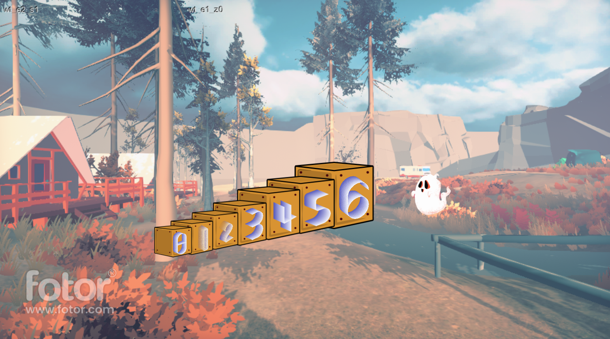

# Welcome to Code Away!

## Concept
In code away, you code your way through the magic world of computer science.
To make progress in the game, you must solve coding questions of varying difficulties.  
The purpose of the game is for players to learn how to code and solve computer science related questions.

## Formal Elements

Feel free to browse the [Formal Elements](./formal_elements.md) section of the project.

## How to play

The game is currently unavailable, but once developed, instructions would be displayed here.