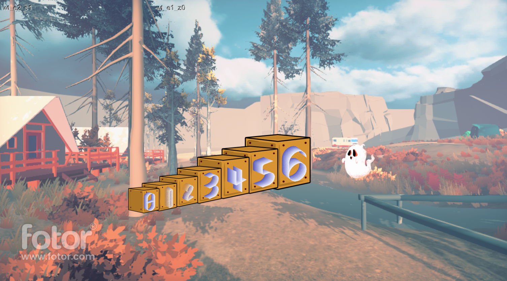

# Code Away

**Code your way through this magical world!**
## Concept

Code Away is an educational, adventure game that takes place in a magical world.  
To make progress in the game, players have to submit pieces of code and understand basic concepts in computer science.

---

## Formal Elements

### 1. Players

* The game's main audience are people wanting to take their first steps in the world of programming and computer science. The game will be suited for ages 12-99. The game requires no previous knowledge in programming and the success in the game is dependent solely on whether the player is willing to learn.

* The game is played in single player mode.

### 2. Goals

* Making progress in the game is done by solving computer science related questions, using C++ Code.
The main goal is to learn how to code and think like a programer.

* The first levels of the game would serve as a tutorial where the player would be asked to code, according to the tradition, a "Hello world!" program and see what happens on the screen.
Because the game is educational, the player learns how to do things during the entire game. So, one can say the entire game is a tutorial!

### 3. Processes

* The player wakes up in a forest and encounters a small ghost. The ghost will aid him in preforming actions. In the first level, the player has to hand a note to a guard in order to enter the game's kingdom. The note has to say "Hello world!". The note can be written by coding the correct code and the ghost will deliver the note to the guard.

* The main process the player will preform is to code in order to solve puzzles. For example, the player has to send the ghost to look for a key inside a row of boxes. The ghost has to preform a binary search in order to find the key in a limited number of steps.

* Every level will be time constrained and will end with electrical power coming through wall outlets and appliances turning on. New levels could always be added and in later version the game's community could create their own puzzles.

* The game will end when the player is at a level of coding where more "serious" research and learning is required.

### 4. Rules

* The player can move any moveable object, even if it seems it will not help them solve the puzzle.

* In single player mode, the player cannot leave the room. In two player mode, the player cannot leave the area in which the two rooms are present.

* The player scores points at the end of the level, based on the amount of damage caused to the room. The less, the better. A 0-3 star system would be put in place.

* Rules of the game would be made clear in the tutorial level. 

### 5. Resources

* The player could make use of every object in the room. Everything, apart from the walls, can be moved and used.

* The player can climb stools to reach a higher shelves, flip switches to power off an appliance, move objects from hazardous positions etc.

* The player can use hint points to get hints that would aid him in solving the current puzzle.

* For every level completed with 3 stars, the player will get coins that can be later used to buy hint points. Hint points will be hard to achieve because the player has to solve the puzzle with 3 stars. 

* The amount of coins and hint points can be displayed in the corner of the screen.

### 6. Conflict

* Time is your main adversary in the game. Players should be quick on their feet and creative. 
* In two player mode, every player has to out-score the other player. 

### 7. Boundaries

The room's walls would serve as the main boundaries of the game. 
A wall is a clear and well known boundary and every child will be able to figure it out.

### 8. Results

* Every level would have 4 available outcomes, represented by the 0-3 stars a player can achieve. 

* The outcome is solely dependent on skills. 
* In both single and two player mode, the game would have complex result. The player will be ranked 0-3 stars according to their performance.

---

## Market Research

Most similar games are:

1. Fire Escape!
    * [Gameplay](https://www.youtube.com/watch?v=EhbXFbKa3Jo)
    
    * Fire escape assumes a fire already started and the player only needs to escape. In our game the player needs to stop the fire from ever taking place.  

2. Oneiros
    * [Gameplay] (https://www.youtube.com/watch?v=Mn4pvzGuCJQ)

    *Oneiros is a first person escape room taking place in a movie theatre, but things get out of hand and become interesting very quickly. The game encourages the player to inspect everything. It is similar to our game in that every object can be interacted with, whether it is useful or not. 

    Our game would be different because it is time constrained and is not for the same audience. 

3. The Room
    * [Gameplay](https://www.youtube.com/watch?v=dRwzDphvhV4&list=PL5dr1EHvfwpP7DB1cqtuSk0r9kl9VhGF1)

    * The room is also a first person escape room game, but it takes place in ancient times.

    * The game is much bigger than what we got planned, hence, it is much slower and much more elaborate.

    * Our game would be much quicker and more agile. The result of each level would not be fixed and it would not be a zero sum game like 'The Room'. 
